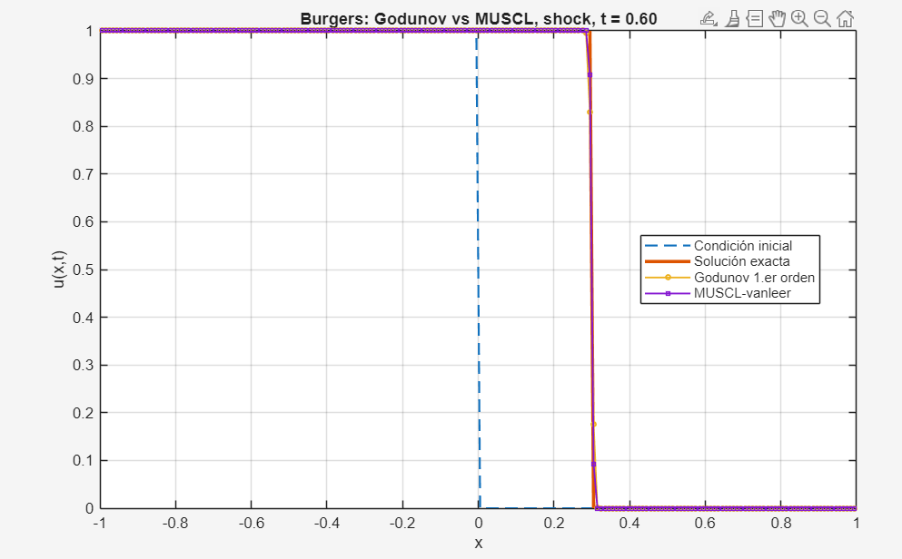
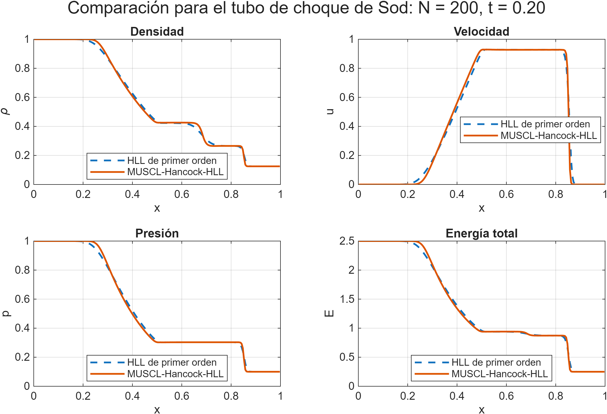
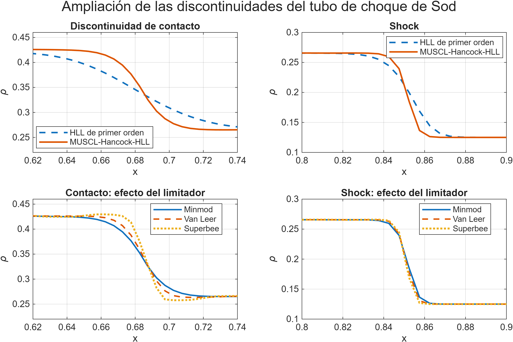
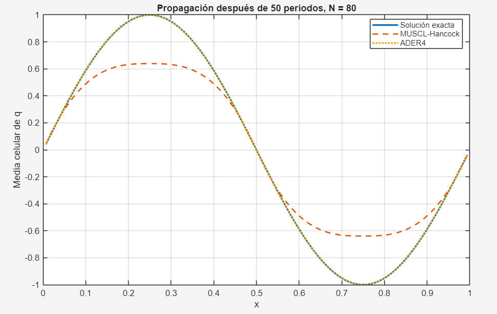
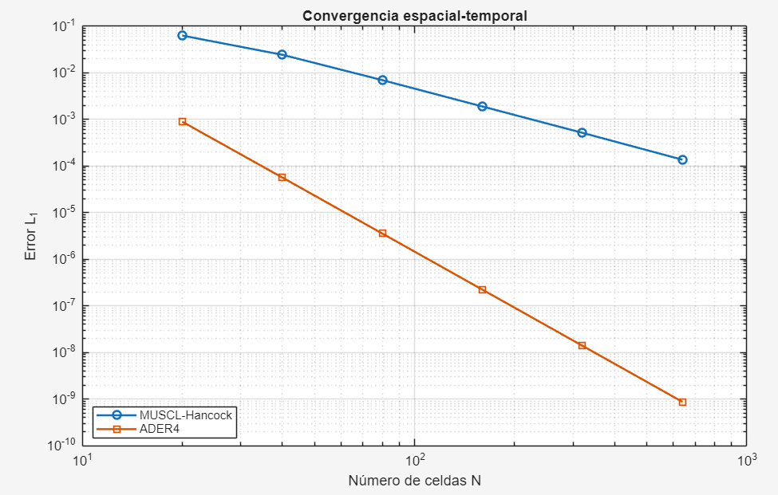

# Finite-Volume Methods for Hyperbolic PDEs in MATLAB

**A progressive numerical study of conservation laws: from first-order transport schemes to MUSCL-Hancock, HLL Riemann solvers, and fourth-order ADER.**

This repository contains the numerical work developed during a research internship at **CITMAGA (Centro de Investigación e Tecnoloxía Matemática de Galicia)**, under the supervision of **Saray Busto Ulloa**.

The project was designed as a structured progression in **scientific computing and numerical analysis**. It starts with the 1D linear advection equation, moves to nonlinear scalar conservation laws through Burgers' equation, extends the finite-volume framework to the **1D compressible Euler equations**, and concludes with a **fourth-order ADER scheme** for smooth periodic advection.

The emphasis is not only on obtaining numerical solutions, but on understanding and measuring:

- conservation and entropy-consistent shock propagation;
- CFL stability and numerical diffusion;
- approximate Riemann solvers;
- TVD slope limiting and high-resolution reconstruction;
- shock, contact, and rarefaction resolution;
- convergence rates and error norms;
- long-time dispersion/dissipation behaviour;
- the trade-off between robustness, accuracy, and formal order.

---

## Project at a glance

| Stage | Governing problem | Numerical methods | Main numerical question |
|---|---|---|---|
| **01** | Linear advection | Centered, Lax-Friedrichs, Upwind | How do stability and numerical diffusion emerge? |
| **02** | Burgers' equation | Godunov, Lax-Friedrichs, Q-scheme | Why is conservation essential for the correct shock speed? |
| **03** | Burgers' equation | MUSCL-Hancock + TVD limiters | How much accuracy can be gained without introducing oscillations? |
| **04** | 1D Euler equations | HLL, MUSCL-Hancock-HLL | How are shocks, contacts, and rarefactions captured in a system of conservation laws? |
| **05** | Smooth linear advection | MUSCL-Hancock vs ADER4 | What is gained by moving from second- to fourth-order accuracy? |
| **06** | Reconstruction study | Minmod / centered / ENO-like slopes | How does slope choice affect reconstruction? |

### Numerical progression

```text
Linear advection
      │
      ├── instability, CFL condition, numerical diffusion
      ▼
Burgers' equation
      │
      ├── entropy solutions, shocks, rarefactions, conservation
      ▼
MUSCL-Hancock
      │
      ├── second-order reconstruction + TVD limiters
      ▼
1D Euler equations
      │
      ├── HLL Riemann solver + Sod shock tube
      ▼
High-order finite-volume methods
      │
      └── fourth-order ADER + long-time convergence analysis
```

---

## Core mathematical setting

The main problems in this repository can be written as hyperbolic conservation laws of the form

$$
\frac{\partial \mathbf{U}}{\partial t}
+ \frac{\partial \mathbf{F}(\mathbf{U})}{\partial x}=0,
$$

where $\mathbf{U}$ is the vector of conserved variables and $\mathbf{F}(\mathbf{U})$ is the physical flux.

The finite-volume update used throughout the project has the generic form

$$
\mathbf{U}_i^{n+1}
=
\mathbf{U}_i^n
-
\frac{\Delta t}{\Delta x}
\left(
\mathbf{F}_{i+1/2}-\mathbf{F}_{i-1/2}
\right).
$$

The numerical work therefore revolves around one central question: **how should the interface fluxes be constructed so that the method remains conservative, stable, accurate, and physically meaningful?**

---

# Featured numerical results

## 1. Burgers: first-order vs high-resolution reconstruction

For the smooth Burgers test at `N = 200`, Van Leer MUSCL-Hancock reduces the L1 error from **2.50e-3** for first-order Godunov to **4.17e-5**.

| Method | L1 error | Linf error | Final TV |
|---|---:|---:|---:|
| Godunov | 2.50051e-3 | 2.69449e-3 | ~0.9938 |
| Minmod | 8.32440e-5 | 5.66190e-4 | 0.99803 |
| **Van Leer** | **4.17380e-5** | **3.15540e-4** | 0.99889 |
| Van Albada | 5.73180e-5 | 4.31100e-4 | 0.99848 |
| Superbee | 7.61420e-5 | 4.95210e-4 | **0.99948** |

<p align="center">
  
</p>

The shock and rarefaction experiments also show the expected limiter trade-off: **Minmod is more diffusive**, while **Superbee produces the sharpest discontinuities** among the tested TVD reconstructions.

The smooth refinement experiment recovers approximately **second-order L1 convergence** for MUSCL-Hancock away from non-smooth regions.

---

## 2. 1D Euler equations: HLL vs MUSCL-Hancock-HLL

The compressible Euler module solves **Sod's shock-tube problem** with `gamma = 1.4`, adaptive CFL time stepping, and conservative finite-volume updates.

<p align="center">
  
</p>

MUSCL-Hancock-HLL resolves the flow structures more sharply than the first-order HLL baseline while remaining non-oscillatory in the reported tests. The implementation also includes limiter comparisons, discontinuity zooms, positivity safeguards for density and pressure, and grid-refinement analysis.

### Self-convergence after conservative restriction

| Grid comparison | Density L1 | Velocity L1 | Pressure L1 | Energy L1 |
|---|---:|---:|---:|---:|
| 100 → 200 | 2.386821e-3 | 4.464160e-3 | 1.833210e-3 | 4.921107e-3 |
| 200 → 400 | 1.246440e-3 | 2.185093e-3 | 8.997976e-4 | 2.453840e-3 |
| 400 → 800 | 6.541981e-4 | 1.044192e-3 | 4.375542e-4 | 1.214176e-3 |

The global observed order remains close to **one**. This is expected for a solution containing shocks and a contact discontinuity: the limiter intentionally reduces the local reconstruction order near non-smooth regions.

<p align="center">
  
</p>

---

## 3. MUSCL-Hancock vs fourth-order ADER

The final module studies smooth periodic linear advection and compares a limited second-order MUSCL-Hancock solver with a **fourth-order ADER** method based on cubic reconstruction and the Cauchy-Kowalewski procedure.

### Long-time propagation: 50 periods, `N = 80`

| Method | L1 | L2 | Linf | Relative amplitude |
|---|---:|---:|---:|---:|
| MUSCL-Hancock | 1.65932e-1 | 2.11394e-1 | 3.60285e-1 | 0.639344 |
| **ADER4** | **1.78131e-4** | **1.97909e-4** | **2.79881e-4** | **1.000002** |

For this smooth long-time benchmark, ADER4 gives approximately **932× lower L1 error** than MUSCL-Hancock and preserves the wave amplitude almost exactly.

<p align="center">
  
</p>

### Experimental convergence

| N | MUSCL L1 | MUSCL order | ADER4 L1 | ADER4 order |
|---:|---:|---:|---:|---:|
| 20 | 6.3069e-2 | — | 8.9445e-4 | — |
| 40 | 2.4450e-2 | 1.3671 | 5.6783e-5 | 3.9775 |
| 80 | 6.9791e-3 | 1.8087 | 3.5626e-6 | 3.9944 |
| 160 | 1.8980e-3 | 1.8786 | 2.2288e-7 | 3.9986 |
| 320 | 5.1622e-4 | 1.8784 | 1.3933e-8 | 3.9996 |
| 640 | 1.3680e-4 | 1.9159 | 8.7079e-10 | **4.0001** |

<p align="center">
  
</p>

The ADER implementation therefore reproduces the expected **fourth-order convergence** with high numerical consistency on the selected smooth periodic problem.

> **Important scope note:** the ADER4 implementation uses unlimited cubic reconstruction and is deliberately evaluated on smooth solutions. It is **not** presented as a shock-capturing replacement for limited MUSCL schemes.

---

# Methods implemented

## Linear advection

Introductory experiments establish the basic numerical concepts used throughout the project:

- explicit centered discretisation as an instability demonstration;
- Lax-Friedrichs;
- upwind differencing;
- finite-volume interpretation of upwind fluxes;
- CFL reasoning and numerical diffusion.

## Burgers' equation — first order

The nonlinear scalar problem introduces:

- exact entropy solutions for Riemann problems;
- Godunov flux;
- Lax-Friedrichs flux;
- Q-scheme;
- conservative vs non-conservative discretisations.

A central result of this module is that **conservative discretisation is essential to recover the correct shock propagation speed**.

## MUSCL-Hancock

The second-order extension combines:

1. piecewise-linear reconstruction;
2. TVD slope limiting;
3. a half-step Hancock predictor;
4. interface Riemann problems;
5. a conservative finite-volume update.

Implemented limiters:

- Minmod;
- Van Leer;
- Van Albada;
- Superbee.

## HLL approximate Riemann solver

For the Euler equations, the HLL flux approximates the Riemann fan from two bounding signal speeds. It provides a robust baseline for compressible-flow calculations, although it does not explicitly resolve the contact wave and is consequently more diffusive around the contact discontinuity.

## Fourth-order ADER

The ADER4 implementation combines:

- cubic reconstruction from cell averages;
- interface derivatives up to third order;
- the Cauchy-Kowalewski procedure;
- fourth-order time averaging of interface fluxes;
- a one-step finite-volume update.

---

# Validation strategy

The implementations are not assessed from plots alone. Depending on the problem, validation includes:

- exact or reference solutions;
- L1, L2, and Linf error norms;
- experimental orders of convergence;
- conservation / mass-balance residuals;
- total-variation monitoring;
- positivity checks for Euler density and pressure;
- limiter comparisons;
- grid-refinement studies;
- long-time propagation tests;
- amplitude preservation and cumulative numerical diffusion.

Detailed quantitative results are collected in [`docs/RESULTS.md`](docs/RESULTS.md).

---

# Repository structure

```text
.
├── README.md
├── CITATION.cff
│
├── methods/
│   ├── 01_linear_advection/
│   ├── 02_burgers_first_order/
│   ├── 03_burgers_muscl_hancock/
│   ├── 04_euler1d_muscl_hll/
│   ├── 05_ader4_linear_advection/
│   └── 06_reconstruction_experiments/
│
├── results/
│   └── figures/
│       ├── 01_linear_advection/
│       ├── 02_burgers_first_order/
│       ├── 03_burgers_muscl_hancock/
│       ├── 04_euler1d_muscl_hll/
│       └── 05_ader4/
│
├── reports/
│   ├── 02_burgers_first_order_analysis_es.pdf
│   ├── 03_burgers_muscl_hancock_report_es.pdf
│   ├── 04_euler1d_muscl_hll_report_es.pdf
│   └── 05_muscl_vs_ader4_report_es.pdf
│
└── docs/
    ├── METHODS.md
    ├── RESULTS.md
    ├── RUN_GUIDE.md
    └── CURATION_NOTES.md
```

Each main method directory contains a short local README describing its numerical purpose and recommended entry points.

---

# Reproducing the experiments

## Requirements

- MATLAB
- No external datasets are required for the main experiments.

The source uses modern MATLAB features such as `arguments`, string scalars, tables, and `exportgraphics`. The exact MATLAB release used during the internship was not recorded, so no unsupported version requirement is claimed.

## Representative entry points

### Burgers — MUSCL-Hancock

```matlab
cd methods/03_burgers_muscl_hancock
main
experiment_smooth_convergence
```

### Euler 1D — Sod shock tube

```matlab
cd methods/04_euler1d_muscl_hll
hll_primer_orden_sod
muscl_hancock_sod
comparacion_hll_muscl
comparacion_limitadores_sod
estudio_refinamiento_sod
```

### MUSCL-Hancock vs ADER4

```matlab
cd methods/05_ader4_linear_advection
main_comparison
convergence_study
error_vs_periods
```

For a complete execution guide, see [`docs/RUN_GUIDE.md`](docs/RUN_GUIDE.md).

---

# Technical reports

The [`reports/`](reports/) directory contains the polished technical reports produced during the project. They are currently written in **Spanish**, while the repository documentation is presented in English for accessibility.

| Report | Topic |
|---|---|
| `02_burgers_first_order_analysis_es.pdf` | First-order conservative schemes for Burgers' equation |
| `03_burgers_muscl_hancock_report_es.pdf` | MUSCL-Hancock, TVD limiters, and convergence |
| `04_euler1d_muscl_hll_report_es.pdf` | HLL and MUSCL-Hancock-HLL for the 1D Euler equations |
| `05_muscl_vs_ader4_report_es.pdf` | Long-time accuracy and convergence of MUSCL-Hancock vs ADER4 |

The reports contain the mathematical derivations, experimental setup, numerical interpretation, and extended discussion behind the code.

---

# Scope and limitations

This repository is intended as a rigorous educational/research implementation of classical finite-volume methods, not as a production CFD package.

- The centered transport scheme is included intentionally to demonstrate instability.
- HLL is robust but does not explicitly resolve the contact wave.
- MUSCL-Hancock is formally second order in smooth regions; limiting reduces the local order near discontinuities.
- Global convergence on Sod's problem is therefore close to first order.
- The ADER4 implementation is designed for **smooth linear advection** and uses unlimited cubic reconstruction.
- Applying the current ADER4 reconstruction directly across shocks would require a suitable non-oscillatory extension, such as WENO or an appropriate limiting strategy.
- CPU timings reported in the technical reports are illustrative and depend on machine and MATLAB JIT behaviour; error norms and convergence rates are the primary validation metrics.

---

# Research context

This work was developed during a research internship at **CITMAGA**, with the objective of building a rigorous foundation in:

- numerical analysis;
- finite-volume methods;
- hyperbolic partial differential equations;
- scientific programming;
- high-order schemes;
- computational modelling.

The project also provided the numerical background for subsequent work involving mathematical and data-driven modelling in biomedical engineering.

---

# Author

**Lucía Gómez Barros**  
Biomedical Engineering — Universidade de Vigo

---

# Acknowledgements

Supervision: **Saray Busto Ulloa — CITMAGA**.

The numerical schemes implemented in this repository are established methods from the finite-volume and hyperbolic-conservation-law literature. The accompanying reports document the theoretical references and derivations used during the internship.

---

# Citation

If you reuse material from this repository, citation metadata are provided in [`CITATION.cff`](CITATION.cff).
